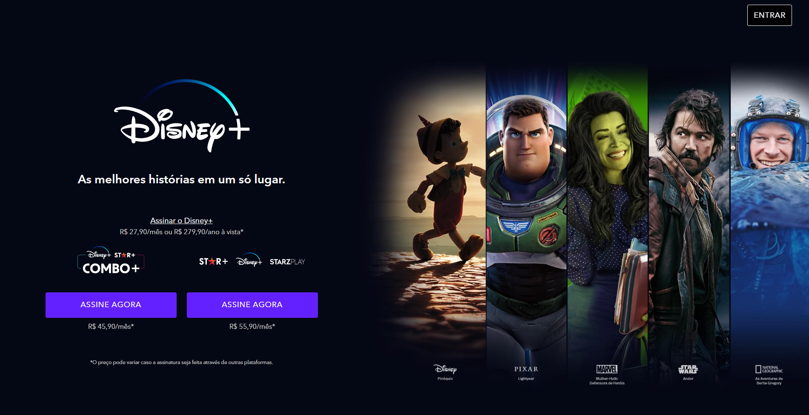

<h1 align="center">
  Disney+ | Clone
</h1>

## 📷 Deploy

<h3>LINK: https://clone-disneyplus-hs.vercel.app/</h3>

## 💻 Projeto
Neste projeto, criamos um clone da landing page do Disney+. Realizado durante o módulo 21 da EBAC - Escola Britânica de Artes Criativas e Tecnologia.

## 🚀 Tecnologias
- Sass
- JavaScript
- Gulp
- HTML
- CSS

## 📔 Conhecimentos utilizados
- [x] Navbar
- [x] Tabs
- [x] Accordions
- [x] Responsividade
